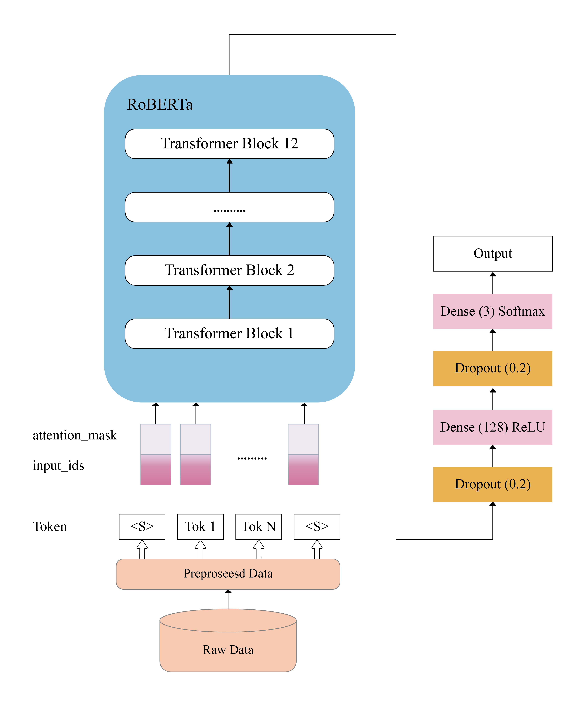
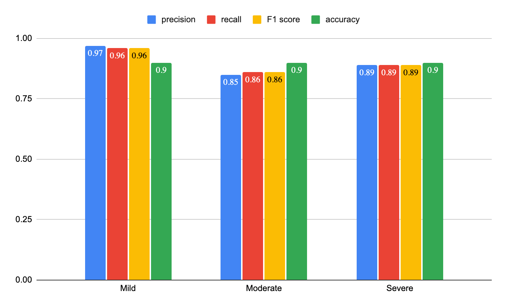

# Multilevel Depression Detection from Twitter using Fine-Tuned RoBERTa

## Introduction
This project aims to detect and analyze different levels of depression (mild, moderate, and severe) through Twitter posts using a fine-tuned RoBERTa model. Our research underscores the importance of social media in early-stage depression detection and offers a novel approach to mental health monitoring.

## Authors
- Afra Zaman
- Syeda Sunjida Ferdous
- Nazneen Akhter
- Tabassum Ibnat Ena
- Md. Mahmudun Nabi
- Salma Akter Asma

## Abstract
Depression is a significant global health issue. Early detection and treatment are crucial in mitigating its impacts. This project utilizes a fine-tuned RoBERTa model to identify multilevel depression from Twitter data, showcasing an accuracy of 90%. The methodology enhances understanding of depression severity and can significantly aid in mental health research and treatment.

## Dataset
The dataset used in this project is derived from Twitter, comprising posts classified into three categories: mild, moderate, and severe, based on the level of depression indicated. A pre-existing twitter dataset in annotated into multiple levels of depression so that the model can be trained for this specific task.

## Model
The project utilizes the RoBERTa model, which has been fine-tuned to better understand the nuances of Twitter language and depression indicators. The model has been enhanced with additional dense layers and trained on a large corpus of data.

## Installation
Instructions for setting up the project environment:
git clone [repository-link]
cd [project-directory]
pip install -r requirements.txt

## Usage
To use the model for depression detection:
python detect_depression.py [options]

## Results
Our model demonstrates a high degree of accuracy in classifying Twitter posts into mild, moderate, and severe depression categories. 

## Contributing
We welcome contributions from the community. If you wish to contribute, please follow these steps:
1. Fork the repository.
2. Create a new branch (`git checkout -b feature-branch`).
3. Make your changes and commit (`git commit -am 'Add some feature'`).
4. Push to the branch (`git push origin feature-branch`).
5. Create a new Pull Request.

